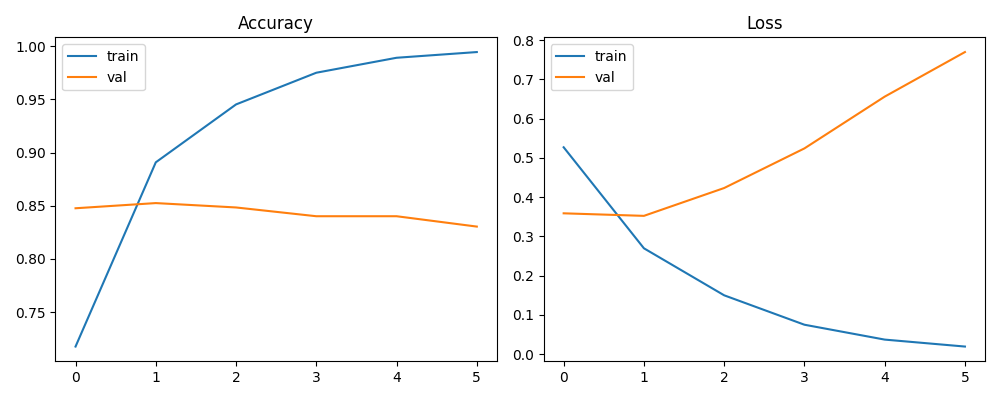

# Sarcasm Embeddings — Fast Baseline + Projections

**TL;DR**: Baseline deteksi sarkasme: TextVectorization → Embedding(16) → Conv1D → GlobalMaxPool → Dense.  
Ringan, stabil, + dieksplor di **TensorFlow Embedding Projector** (word & sentence).



## Dataset
- `sarcasm.json` (≈26k headlines). Diunduh otomatis saat run.

## Arsitektur
- Vectorizer: lower + strip punctuation, `seq_len=32`, `vocab=20k`
- Model: `Embedding(16) → Conv1D(128,5) → GlobalMaxPool → Dense(64, relu) → Dense(1, sigmoid)`

## Cara jalan (local/WSL)
```bash
python -m venv .venv && source .venv/bin/activate
pip install -r requirements.txt

# train + simpan artefak
python src/train.py

# export file untuk Embedding Projector (word & sentence)
python src/export_projector.py

Embedding Projector (Web)

Word projection: projector/word/{vectors.tsv, metadata.tsv}

Load di https://projector.tensorflow.org
 → Label by = token (bisa search kata)

Sentence projection: projector/sent/{vectors.tsv, metadata.tsv}

Color by = label
Contoh visual:
Word PCA:
Sentence PCA:
Hasil singkat
Val accuracy: (isi angka run kamu)

Insight: tetangga kata hate/hates/hatred masuk cluster; ruang kalimat mulai memisah by label meski model kecil.
Roadmap
Bandingkan BiLSTM vs Conv1D.
Coba UMAP untuk sentence features.
GloVe vs learned embedding.


Lalu commit:
```bash
git add README.md && git commit -m "docs: add README with projector instructions" && git push
